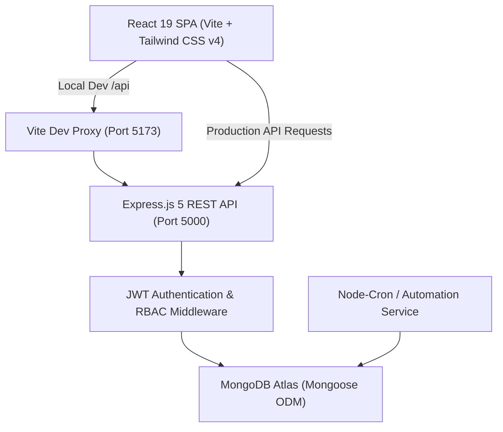

# Forti Foods — Executive & Operations Dashboard

[](#technology-stack)
[](https://nodejs.org/)
[](#)

A centralized, dashboard and executive business intelligence platform built for **Forti Foods** and its flagship initiative, **My Meal Mate (MMM)**.

The platform unifies core business workflows previously managed across separate Excel trackers - including inventory tracking, sales & BD pipelines, school partnerships, grant discovery, social media analytics, automated business anomaly detection, and granular role-based access control (RBAC).

---

## Table of Contents

- [Core Business Modules](#-core-business-modules)
- [Architecture & Tech Stack](#-architecture--tech-stack)
- [Role-Based Access Control (RBAC)](#-role-based-access-control-rbac)
- [Project Directory Structure](#-project-directory-structure)
- [Getting Started](#-getting-started)
  - [Prerequisites](#prerequisites)
  - [Installation](#installation)
  - [Environment Configuration](#environment-configuration)
  - [Database Seeding](#database-seeding)
  - [Running Locally](#running-locally)
- [Deployment Guide](#-deployment-guide)
  - [Backend Deployment (Render)](#1-backend-deployment-render)
  - [Frontend Deployment (Vercel)](#2-frontend-deployment-vercel)
- [Automations & Background Jobs](#-automations--background-jobs)
- [API Overview](#-api-overview)

---

## Core Business Modules

### 1. Executive Dashboard & Weekly Reporting

- **Unified KPI Overview**: High-level cross-vertical visibility aggregating stock valuation, pipeline value, active subscriber progress, and weekly social reach.
- **Weekly Snapshot Engine**: Automated capture of business health metrics with historical comparisons and exportable reports.

### 2. Inventory & Stock Management

- **Product Lifecycle Tracking**: Track products with unit costs, production quantities, batch expiry dates, and real-time stock balances.
- **Automated Health Status**: Intelligent status engine categorizing inventory into `OK`, `Slow Mover`, `At Risk`, `Depleted`, `Expired`, and `Reorder`.
- **Valuation & Cover**: Live computation of Total Stock Value at Cost, Sell-Through Rates (%), and Weeks of Cover.

### 3. Business Development & Sales Pipeline

- **Deal Management**: Track deals across formal stages (`Prospecting`, `Qualification`, `Proposal`, `Negotiation`, `Closed Won`, `Closed Lost`).
- **RAG & Forecast Health**: Red/Amber/Green visual indicators, deal weightings, and forecast categories (`Commit`, `Best Case`, `Pipeline`, `Omitted`).
- **Rep Activity Tracking**: Daily activity logging (calls, emails, meetings, site visits, proposals sent) with performance metrics.

### 4. Grants & Funding Tracker

- **Opportunity Pipeline**: Track non-dilutive funding, accelerators, competitions, fellowships, and awards.
- **Stage Progression**: Manage funding from `Researching` and `In Progress` through to `Submitted`, `Accepted`, or `Waitlisted`.

### 5. My Meal Mate (MMM) Program

- **School Partner Network**: Manage beneficiary schools across vetting tiers (`Identified`, `Vetted`, `Supported`) with priority scoring (1–10).
- **Subscriber & Donation Tracking**: Live tracking of meal subscriptions against organizational growth targets.

### 6. Social Media Analytics

- **Instagram Marketing Tracker**: Track weekly follower counts, net follower growth, impressions, reach, and engagement rates.
- **Performance Trends**: Historical charts visualizing brand visibility and campaign traction.

### 7. Automated Business Gaps & Threshold Alerts

- **Automated Anomaly Detection**: Background evaluation engine identifying business risks (e.g., inventory approaching expiry within 30 days, low sell-through, stale deals, or follower drops).
- **Issue Resolution Workflow**: Severity-classified flags (`Critical`, `Warning`) with actionable audit resolution steps.

### 8. Admin, User Management & Bulk Data Import

- **User Administration**: Role assignment, profile management, and secure account deactivation.
- **Data Import Wizard**: Step-by-step CSV/Excel ingestion pipeline with column auto-matching, schema validation (via Zod), and preview verification.

---

## Architecture & Tech Stack



### Frontend (`client/`)

- **Framework**: React 19 + Vite 6
- **Routing**: React Router DOM 7
- **Styling**: Tailwind CSS v4 + Lucide React Icons
- **HTTP Client**: Axios (with response interceptors & credential handling)
- **UI Notifications**: React Toastify

### Backend (`server/`)

- **Runtime**: Node.js (ES Modules)
- **Framework**: Express.js 5
- **Database & ODM**: MongoDB Atlas with Mongoose 8
- **Security & Utilities**: Helmet, CORS, Morgan, Compression, Cookie-Parser, BcryptJS
- **Authentication**: JSON Web Tokens (JWT)
- **Validation**: Zod Schemas
- **Scheduling**: Node-Cron (local/persistent server background jobs)

### Shared (`shared/`)

- Universal constants, role definitions, access permissions, and validation helpers shared across frontend and backend.

---

## Role-Based Access Control (RBAC)

The system defines 8 granular roles with scoped permission matrices across all 6 application modules:

| Role Name                | Description            | Key Capabilities                                                                       |
| :----------------------- | :--------------------- | :------------------------------------------------------------------------------------- |
| **Founder / Admin**      | Executive leadership   | Full CRUD access across all modules, user administration, and system configuration.    |
| **BI & Ops Analyst**     | Operations & analytics | Read and edit access across all verticals; manages operational thresholds and reports. |
| **Inventory Lead**       | Warehouse & logistics  | Full management of products, purchase orders, inventory movements, and stock batches.  |
| **Sales / BD Lead**      | Commercial management  | Full control over sales deals, reps, activity logs, and pipeline metrics.              |
| **Rep**                  | Field representative   | View access to pipeline; ability to log own activities and updates.                    |
| **Marketing Lead**       | Brand & social growth  | Full management of social media metrics, marketing campaigns, and lead data.           |
| **Program Coordinator**  | School operations      | Full management of My Meal Mate schools, subscriber quotas, and donations.             |
| **Viewer / Stakeholder** | Read-only stakeholder  | Read-only access with sensitive financial masking (restricted margins and costs).      |

### Sensitive Field Masking

When users have `view_restricted` access, backend interceptors automatically omit confidential fields:

- **Inventory**: `unit_cost`, `stock_value_at_cost`
- **Sales Pipeline**: `value_naira`

---

## Project Directory Structure

```text
forti_dashboard/
├── client/                     # Frontend Application (React + Vite)
│   ├── src/
│   │   ├── components/         # Reusable UI, forms, layout & navigation
│   │   │   ├── common/         # DataTable, KPICard, Modal, StatusBadge
│   │   │   ├── dashboard/      # Hero cards, metrics widgets
│   │   │   └── layout/         # AppLayout, Sidebar, Topbar, ProtectedRoute
│   │   ├── contexts/           # AuthContext & global state providers
│   │   ├── pages/              # Domain views (inventory, sales, bd, admin, etc.)
│   │   ├── services/           # Axios instance & domain API clients
│   │   ├── styles/             # Global Tailwind & design system styles
│   │   ├── App.jsx             # Route definitions & permission guards
│   │   └── main.jsx            # Application entry point
│   ├── package.json
│   └── vite.config.js          # Vite config with dev reverse proxy
│
├── server/                     # Backend Application (Express + Mongoose)
│   ├── src/
│   │   ├── config/             # Database connection, env loader, seed script
│   │   ├── controllers/        # Request handlers per domain
│   │   ├── middleware/         # Auth, RBAC, error handling, validation
│   │   ├── models/             # Mongoose schemas (Products, Deals, Schools, etc.)
│   │   ├── routes/             # Express route modules
│   │   ├── services/           # Business logic, aggregations & automations
│   │   ├── validators/         # Zod schemas for input validation
│   │   ├── app.js              # Express app setup & server initialization
│   │   └── cron-runner.js      # Background scheduled jobs
│   └── package.json
│
├── shared/                     # Shared Constants & Types
│   └── constants.js            # Roles, permission matrices, status enums
│
├── .env.example                # Template for environment configuration
├── package.json                # Root orchestration scripts
└── README.md                   # Project documentation
```

---

## Getting Started

### Prerequisites

- **Node.js**: v18.0.0 or higher
- **npm**: v9.0.0 or higher
- **MongoDB Atlas** database cluster (or local MongoDB instance)

### Installation

Clone the repository and install all root and sub-package dependencies:

```bash
# 1. Clone the repository
git clone https://github.com/Pharez-Oyelade/forti-food-dashboard.git
cd forti-food-dashboard

# 2. Install all dependencies (root, server, and client)
npm run install:all
```

_Alternatively, run `npm install` in the root, `server/`, and `client/` directories manually._

---

### Environment Configuration

Create a `.env` file in the **root directory** (use `.env.example` as a template):

```env
# ── Server Configuration ──
PORT=5000
NODE_ENV=development

# ── Database ──
MONGO_URI=mongodb+srv://<username>:<password>@<cluster>.mongodb.net/forti_dashboard?retryWrites=true&w=majority

# ── Authentication ──
JWT_SECRET=your_super_secret_jwt_key_here_change_in_production
JWT_EXPIRES_IN=24h

# ── CORS Settings ──
CORS_ORIGIN=http://localhost:5173

# ── Default Admin Seed Credentials ──
ADMIN_EMAIL=admin@fortifoods.com
ADMIN_PASSWORD=changeme123
ADMIN_NAME=Forti Admin
```

---

### Database Seeding

Initialize the database with the core role permissions matrix, default admin account, and starter operational data. In the server directory:

```bash
npm run seed
```

Default credentials generated by the seeder:

- **Email**: `admin@fortifoods.com`
- **Password**: `changeme123`

The default credentials can be changed on the dashboard after successful seeding

---

### Running Locally

Start both the backend API server and frontend Vite development server concurrently:

```bash
npm run dev
```

- **Frontend**: Accessible at [http://localhost:5173](http://localhost:5173)
- **Backend API**: Accessible at [http://localhost:5000/api/health](http://localhost:5000/api/health)

_To run either service independently:_

- `npm run dev:server` — Starts only the Express backend on port `5000` with `nodemon`
- `npm run dev:client` — Starts only the Vite frontend on port `5173`

---

## Deployment Guide

The recommended architecture deploys the **API backend to Render** and the **SPA frontend to Vercel**.

### 1. Backend Deployment (Render)

1. Create a **New Web Service** in [Render](https://render.com/).
2. Connect your Git repository.
3. Configure the service settings:
   - **Root Directory**: `server`
   - **Environment**: `Node`
   - **Build Command**: `npm install`
   - **Start Command**: `npm start`
4. Set Environment Variables in Render:
   - `NODE_ENV`: `production`
   - `PORT`: `10000` _(Render sets this automatically)_
   - `MONGO_URI`: _Your production MongoDB Atlas connection string_
   - `JWT_SECRET`: _A secure, cryptographically random 64-character string_
   - `JWT_EXPIRES_IN`: `24h`
   - `CORS_ORIGIN`: `https://<your-vercel-domain>.vercel.app`

---

### 2. Frontend Deployment (Vercel)

1. Import your Git repository into [Vercel](https://vercel.com/).
2. Configure the project settings:
   - **Framework Preset**: `Vite`
   - **Root Directory**: `client`
   - **Build Command**: `npm run build`
   - **Output Directory**: `dist`
3. Add Environment Variable:
   - `VITE_API_URL`: `https://<your-render-backend-url>.onrender.com/api/v1`
4. Deploy. Vercel will build the static SPA bundle and serve client-side routing via `client/vercel.json`.

---

## Automations & Background Jobs

The dashboard includes automated background processors to maintain data integrity and generate alerts:

- **Weekly Executive Snapshots**: Runs weekly (Sunday midnight) to calculate and lock in week-over-week performance deltas.
- **Anomaly Detection & Threshold Evaluator**: Evaluates business criteria (expiring inventory, stale leads, overdue purchase orders) to generate actionable flags on the Insights page.
- **Execution Mode**:
  - **Local & Render**: Handled automatically in-memory via `node-cron` inside [server/src/cron-runner.js](file:///server/src/cron-runner.js).
  - **Serverless (Optional)**: Triggerable externally via authenticated HTTP POST endpoints at `/api/v1/cron/automations` and `/api/v1/cron/snapshot`.

---

## API Overview

All business endpoints are grouped under `/api/v1`:

| Resource Endpoint    | Description              | Key Operations                               |
| :------------------- | :----------------------- | :------------------------------------------- |
| `/api/v1/auth`       | Authentication & Session | Login, Logout, Session restore (`/me`)       |
| `/api/v1/dashboard`  | Aggregated Analytics     | High-level executive KPI summary             |
| `/api/v1/products`   | Inventory Management     | Product catalog, stock levels, batch dates   |
| `/api/v1/deals`      | Sales Pipeline           | Deals, deal stages, and win/loss tracking    |
| `/api/v1/activities` | BD Rep Activities        | Sales activity logging & rep metrics         |
| `/api/v1/grants`     | Funding Pipeline         | Grant opportunities and status tracking      |
| `/api/v1/schools`    | MMM School Network       | Partner school directory and priority levels |
| `/api/v1/mealmate`   | Meal Mate Program        | Active subscriptions and target progress     |
| `/api/v1/marketing`  | Social Media             | Weekly Instagram performance metrics         |
| `/api/v1/gaps`       | Business Gaps            | Automated alert flags and issue resolution   |
| `/api/v1/reports`    | Executive Reporting      | Weekly snapshot generation and reports       |
| `/api/v1/users`      | User Administration      | User CRUD, role updates, deactivation        |
| `/api/v1/import`     | Data Ingestion           | Multi-step CSV data validation and commit    |
| `/api/v1/cron`       | Automation Triggers      | Manual or scheduled cron triggers            |

---

## Contributors & Acknowledgements

Built for **Forti Foods** to power data-driven decisions and operational efficiency across food production, school nutrition initiatives, and institutional sales.
